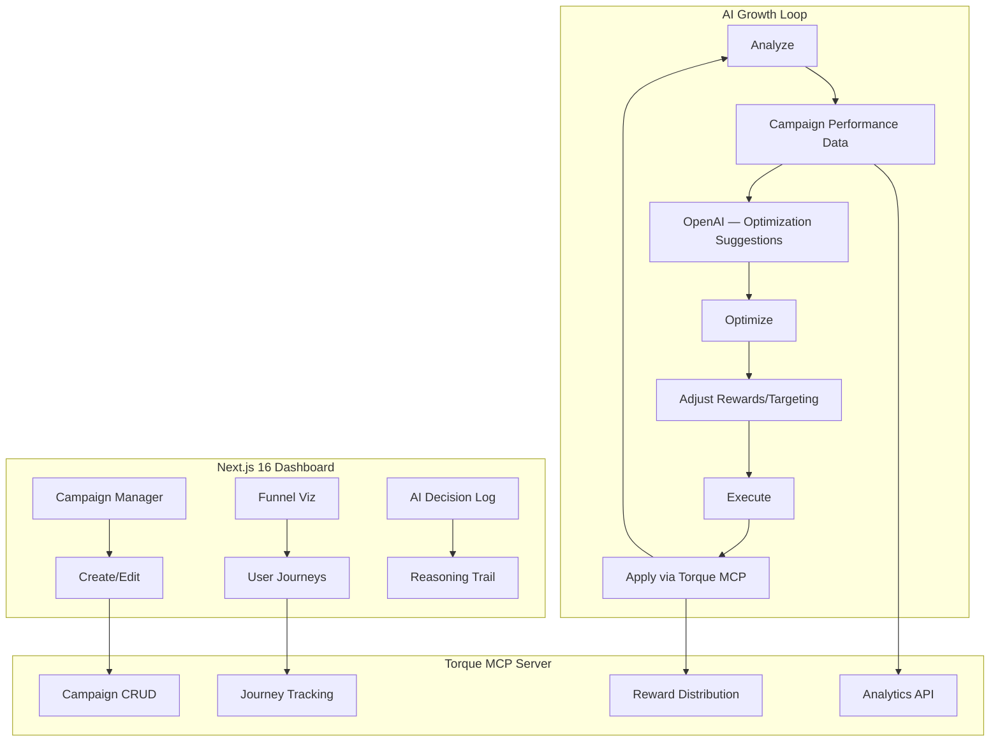

# Agemo — Technical Architecture

## System Architecture



## Tech Stack

| Layer | Technology |
|---|---|
| **Frontend** | Next.js 16, React 19, Tailwind v4 |
| **Agent** | Torque MCP SDK, OpenAI API |
| **Database** | Supabase (campaign data, AI logs) |

## Torque MCP Integration Map

| Feature | Use Case | Depth |
|---|---|---|
| **Campaign CRUD** | Create/update/delete growth campaigns | 🟢 Core |
| **Journey Tracking** | Track user paths through campaigns | 🟢 Core |
| **Reward Distribution** | Allocate/adjust referral and task rewards | 🟢 Core |
| **Analytics** | Campaign performance metrics | 🟢 Core |
| **MCP Protocol** | Agent communicates via MCP tooling | 🟢 Star Feature |

## API Routes

| Method | Path | Description |
|---|---|---|
| POST | `/api/campaigns` | Create campaign via Torque MCP |
| GET | `/api/campaigns/:id/analytics` | Get performance metrics |
| POST | `/api/agent/analyze` | AI analyzes campaign data |
| POST | `/api/agent/optimize` | AI suggests optimizations |
| POST | `/api/agent/execute` | AI applies changes via Torque |
| GET | `/api/agent/decisions` | AI decision trail log |

## Database Schema

```sql
CREATE TABLE campaigns (
    id UUID PRIMARY KEY DEFAULT gen_random_uuid(),
    torque_campaign_id TEXT UNIQUE,
    name TEXT NOT NULL,
    reward_type TEXT,
    reward_amount NUMERIC,
    status TEXT DEFAULT 'active',
    created_at TIMESTAMPTZ DEFAULT NOW()
);

CREATE TABLE ai_decisions (
    id UUID PRIMARY KEY DEFAULT gen_random_uuid(),
    campaign_id UUID REFERENCES campaigns(id),
    action TEXT NOT NULL,
    reasoning TEXT NOT NULL,
    before_metrics JSONB,
    after_metrics JSONB,
    applied BOOLEAN DEFAULT FALSE,
    created_at TIMESTAMPTZ DEFAULT NOW()
);
```
